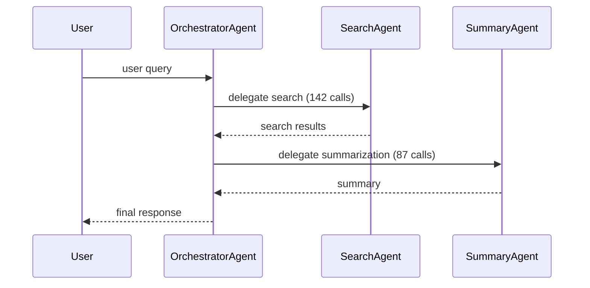
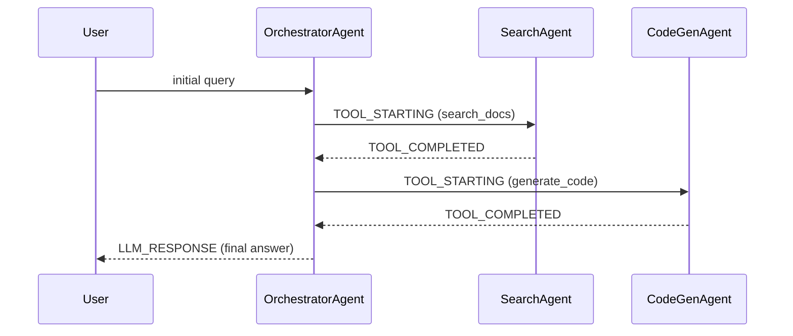

# BigQuery Agent Analytics Skill

## Trigger

Activate when the user asks about agent performance, errors, token usage,
latency, costs, tool call patterns, session analysis, or debugging from
BigQuery Agent Analytics (BQAA) data.

## Config

All placeholders are auto-injected by `scripts/run_bq.py` from environment
variables. The LLM should write SQL using these placeholders as-is:

- `{PROJECT}` — GCP project ID (env var: `GCP_PROJECT_ID`)
- `{DATASET}` — BigQuery dataset name (env var: `BQ_DATASET`)
- `{TABLE}` — Table name (env var: `BQ_TABLE`, default: `agent_events`)

DO NOT ask the user for project ID, dataset, or table name. The execution
helper reads them from environment variables automatically.

---

## 1. Execution Helper

ALWAYS execute BigQuery queries using the helper script:

```bash
python scripts/run_bq.py "SELECT ..."
```

The helper automatically replaces `{PROJECT}`, `{DATASET}`, and `{TABLE}`
in your SQL with the user's configured values from environment variables.
Never use `bq query` directly.

### CRITICAL: Dry-Run Cost Check

**Before running ANY query, you MUST execute a dry-run first:**

```bash
python scripts/run_bq.py --dry-run "YOUR_SQL"
```

This returns the estimated bytes scanned without executing the query.
**If the estimated data scanned exceeds 1 GB, you MUST refine your query
before executing** (e.g., add a tighter date filter, remove unnecessary
columns, add LIMIT). Only proceed with the actual query after the dry-run
confirms the scan is under the limit.

Example dry-run output:
```json
{"dry_run": true, "total_bytes_processed": 524288000, "human_readable": "500.00 MB", "exceeds_limit": false, "limit_gb": 1}
```

If `exceeds_limit` is `true`, do NOT execute. Refine and re-check.

---

## 2. Schema Reference

Single event-sourced table: `{PROJECT}.{DATASET}.{TABLE}`

| Column         | Type            | Notes                                                         |
|----------------|-----------------|---------------------------------------------------------------|
| timestamp      | TIMESTAMP       | UTC, microsecond precision                                    |
| event_type     | STRING          | LLM_REQUEST, LLM_RESPONSE, TOOL_STARTING, TOOL_COMPLETED,    |
|                |                 | HITL_CREDENTIAL_REQUEST, HITL_CREDENTIAL_REQUEST_COMPLETED,   |
|                |                 | HITL_CONFIRMATION_REQUEST, HITL_INPUT_REQUEST,                |
|                |                 | HITL_INPUT_REQUEST_COMPLETED, STATE_DELTA                     |
| agent          | STRING          | Agent name responsible for the event                          |
| session_id     | STRING          | Persistent conversation thread identifier                     |
| invocation_id  | STRING          | Unique identifier for a single execution turn                 |
| user_id        | STRING          | User who initiated the session                                |
| trace_id       | STRING          | OpenTelemetry Trace ID (32-char hex)                          |
| span_id        | STRING          | OpenTelemetry Span ID (16-char hex)                           |
| parent_span_id | STRING          | Span ID of immediate caller — used for delegation trees       |
| content        | JSON            | POLYMORPHIC — structure depends on event_type (see below)     |
| content_parts  | REPEATED RECORD | Multimodal segments: mime_type, uri, object_ref, text,        |
|                |                 | part_index, part_attributes, storage_mode                     |
| attributes     | JSON            | model, usage_metadata, session_metadata, custom_tags          |
| latency_ms     | JSON            | $.total_ms, $.time_to_first_token_ms                          |
| status         | STRING          | OK or ERROR                                                   |
| error_message  | STRING          | Exception details when status = ERROR                         |
| is_truncated   | BOOLEAN         | True if content exceeded cell size limit                      |

### Content field by event_type

| event_type     | content structure                                             |
|----------------|---------------------------------------------------------------|
| LLM_REQUEST    | $.system_prompt, $.prompt[] (array of {role, content})        |
| LLM_RESPONSE   | $.response (text)                                             |
| TOOL_STARTING  | $.tool (name), $.args (object), $.tool_origin                 |
| TOOL_COMPLETED | $.tool (name), $.result, $.tool_origin                        |
| HITL_*         | Human-in-the-loop credential/input/confirmation payloads      |
| STATE_DELTA    | State changes tracked in attributes.state_delta               |

### Attributes field (common nested paths)

- `$.model` — model identifier (e.g., "gemini-2.0-flash")
- `$.usage_metadata.prompt_tokens` — input token count
- `$.usage_metadata.completion_tokens` — output token count
- `$.usage_metadata.total_tokens` — total token count
- `$.session_metadata` — session-level metadata
- `$.custom_tags` — user-defined tags

### content_parts nested structure

```
content_parts[]:
  mime_type      STRING
  uri            STRING
  object_ref:
    uri          STRING
    version      STRING
    authorizer   STRING
    details      JSON
  text           STRING
  part_index     INT64
  part_attributes STRING
  storage_mode   STRING
```

---

## 3. Base CTEs (MANDATORY)

These traces use deeply nested JSON fields. DO NOT write raw `JSON_VALUE()`
or `JSON_EXTRACT()` calls from scratch. ALWAYS start every query with one
or more of the base CTEs below.

### CTE: llm_responses

Use for: token usage, latency, model analysis, cost estimation.

```sql
WITH llm_responses AS (
  SELECT
    timestamp,
    agent,
    session_id,
    invocation_id,
    user_id,
    trace_id,
    span_id,
    parent_span_id,
    JSON_VALUE(content, '$.response')                                       AS response_text,
    JSON_VALUE(attributes, '$.model')                                       AS model_id,
    CAST(JSON_VALUE(attributes, '$.usage_metadata.prompt_tokens')      AS INT64)   AS prompt_tokens,
    CAST(JSON_VALUE(attributes, '$.usage_metadata.completion_tokens')  AS INT64)   AS completion_tokens,
    CAST(JSON_VALUE(attributes, '$.usage_metadata.total_tokens')       AS INT64)   AS total_tokens,
    CAST(JSON_VALUE(latency_ms, '$.total_ms')                          AS FLOAT64) AS total_latency_ms,
    CAST(JSON_VALUE(latency_ms, '$.time_to_first_token_ms')            AS FLOAT64) AS ttft_ms,
    status,
    error_message
  FROM `{PROJECT}.{DATASET}.{TABLE}`
  WHERE event_type = 'LLM_RESPONSE'
    AND timestamp BETWEEN @start AND @end
)
```

### CTE: tool_calls

Use for: tool performance, failure rates, tool origin analysis.

```sql
WITH tool_calls AS (
  SELECT
    timestamp,
    agent,
    session_id,
    invocation_id,
    user_id,
    trace_id,
    span_id,
    JSON_VALUE(content, '$.tool')                          AS tool_name,
    JSON_VALUE(content, '$.tool_origin')                   AS tool_origin,
    JSON_VALUE(content, '$.result')                        AS tool_result,
    CAST(JSON_VALUE(latency_ms, '$.total_ms') AS FLOAT64)  AS tool_latency_ms,
    status,
    error_message
  FROM `{PROJECT}.{DATASET}.{TABLE}`
  WHERE event_type = 'TOOL_COMPLETED'
    AND timestamp BETWEEN @start AND @end
)
```

### CTE: errors

Use for: error investigation, failure root cause analysis.

```sql
WITH errors AS (
  SELECT
    timestamp,
    event_type,
    agent,
    session_id,
    invocation_id,
    user_id,
    trace_id,
    span_id,
    content,
    attributes,
    latency_ms,
    error_message
  FROM `{PROJECT}.{DATASET}.{TABLE}`
  WHERE status = 'ERROR'
    AND timestamp BETWEEN @start AND @end
)
```

### CTE: sessions

Use for: session-level rollups, duration analysis, cost estimation.

```sql
WITH sessions AS (
  SELECT
    session_id,
    user_id,
    MIN(timestamp)                                              AS session_start,
    MAX(timestamp)                                              AS session_end,
    TIMESTAMP_DIFF(MAX(timestamp), MIN(timestamp), SECOND)      AS duration_sec,
    COUNT(*)                                                    AS total_events,
    COUNTIF(event_type = 'LLM_RESPONSE')                        AS llm_calls,
    COUNTIF(event_type = 'TOOL_COMPLETED')                      AS tool_calls,
    COUNTIF(status = 'ERROR')                                   AS error_count,
    COUNT(DISTINCT agent)                                       AS agents_involved,
    COUNT(DISTINCT invocation_id)                                AS invocation_count
  FROM `{PROJECT}.{DATASET}.{TABLE}`
  WHERE timestamp BETWEEN @start AND @end
  GROUP BY session_id, user_id
)
```

### CTE: agent_tree

Use for: multi-agent delegation flows, detecting loops.

```sql
WITH agent_tree AS (
  SELECT
    a.trace_id,
    a.span_id           AS child_span,
    a.agent              AS child_agent,
    a.event_type         AS child_event,
    a.timestamp          AS child_timestamp,
    b.span_id            AS parent_span,
    b.agent              AS parent_agent,
    b.event_type         AS parent_event
  FROM `{PROJECT}.{DATASET}.{TABLE}` a
  LEFT JOIN `{PROJECT}.{DATASET}.{TABLE}` b
    ON  a.parent_span_id = b.span_id
    AND a.trace_id       = b.trace_id
  WHERE a.timestamp BETWEEN @start AND @end
)
```

**RULE:** Compose queries by stacking these CTEs. Never rewrite the JSON
extraction paths. If you need to combine CTEs, use comma-separated WITH
clauses.

---

## 4. Analysis Methodology (FOLLOW THIS ORDER)

When the user asks an analytics question, ALWAYS follow these steps in
sequence. Do not skip to a deep dive. Present findings at each step before
proceeding.

### Step 1: Survey

Count total events, errors, and unique agents in the requested time window.
This grounds the analysis and prevents jumping to conclusions.

```sql
SELECT
  COUNT(*)                                                        AS total_events,
  COUNTIF(status = 'ERROR')                                       AS errors,
  ROUND(COUNTIF(status = 'ERROR') / COUNT(*) * 100, 2)            AS error_rate_pct,
  COUNT(DISTINCT session_id)                                      AS sessions,
  COUNT(DISTINCT agent)                                           AS agents,
  COUNT(DISTINCT user_id)                                         AS users,
  APPROX_QUANTILES(
    CAST(JSON_VALUE(latency_ms, '$.total_ms') AS FLOAT64), 100
  )[OFFSET(95)]                                                   AS p95_latency_ms
FROM `{PROJECT}.{DATASET}.{TABLE}`
WHERE timestamp BETWEEN @start AND @end
```

Present as a single summary line:
> "7,234 events | 3.2% error rate | p95 latency 1,847ms | 12 agents | 45 sessions"

If Step 1 shows no issues, tell the user and stop.

### Step 2: Filter

Isolate the top 3 contributors to the issue. Use the appropriate CTE:
- Token/latency questions -> `llm_responses` CTE
- Tool failure questions -> `tool_calls` CTE
- Error investigations -> `errors` CTE

```sql
-- Example: top 3 error contributors
SELECT agent, event_type,
  COUNT(*) AS total,
  COUNTIF(status = 'ERROR') AS failures,
  ROUND(COUNTIF(status = 'ERROR') / COUNT(*) * 100, 2) AS fail_rate_pct
FROM `{PROJECT}.{DATASET}.{TABLE}`
WHERE timestamp BETWEEN @start AND @end
GROUP BY agent, event_type
ORDER BY failures DESC
LIMIT 3
```

Present as a markdown table, max 3 rows.

### Step 3: Deep Dive

Extract the full raw trace for ONE representative failure from the top
offender. Show the user the actual event sequence so they can see the payload.

```sql
SELECT timestamp, event_type, agent, content, attributes,
       latency_ms, status, error_message
FROM `{PROJECT}.{DATASET}.{TABLE}`
WHERE trace_id = @problematic_trace_id
ORDER BY timestamp ASC
```

Present the trace chronologically in a code block with a plain-english
walkthrough of what happened.

---

## 5. Common Failure Patterns

After running queries, check if results match any known pattern. ALWAYS
map findings to this table and state which pattern matched.

| Signal | Likely Cause | Diagnostic Next Step |
|--------|-------------|---------------------|
| p95_latency high + total_tokens low | Tool call overhead or cold starts | Use `tool_calls` CTE: `AVG(tool_latency_ms) GROUP BY tool_name` to find the slow tool |
| error_rate spikes on one model_id | Model version regression or prompt schema drift | Use `llm_responses` CTE: error rate `GROUP BY model_id`, compare working vs failing versions |
| prompt_tokens growing over time | System prompt bloat or unbounded context accumulation | Use `llm_responses` CTE: `AVG(prompt_tokens)` by `DATE(timestamp)` to see the growth curve |
| tool failures on one tool_origin only | Custom tool bug (not a platform issue) | Use `tool_calls` CTE: fail rate `GROUP BY tool_origin, tool_name` |
| High HITL event count | Agent asking too many confirmations, slowing the session | `COUNT(*) WHERE event_type LIKE 'HITL_%' GROUP BY agent` |
| session duration_sec very high but few events | Long waits between turns — likely HITL or rate limiting | Use `sessions` CTE: compare `duration_sec` vs `total_events` |
| agent_tree shows A->B->A cycles | Delegation loop — agents calling each other recursively | Use `agent_tree` CTE: `WHERE child_agent = parent_agent` or detect bidirectional edges |
| TTFT high but total latency normal | Model queue time / cold start, not generation time | Use `llm_responses` CTE: `AVG(ttft_ms)` vs `AVG(total_latency_ms)` by hour |
| is_truncated = true on error events | Error context was cut off — need GCS fallback for full payload | Check if `content_parts[].object_ref.uri` has a GCS reference |
| Sudden drop in total event count | Instrumentation broke, not fewer calls | Check if specific `agent` values disappeared from recent data |
| error_rate normal but p50_latency creeping up | Queue saturation or rate limiting | Check latency correlation with time-of-day or concurrent session count |

Say: "This matches pattern: [X]. Recommended next step: [Y]."

---

## 6. Visualization Rules

Always match query output to the correct visualization format:

| CTE / Query Used | Required Output Format |
|-----------------|----------------------|
| `agent_tree` / `agent_delegation_map.sql` | ALWAYS render as a **Mermaid.js `sequenceDiagram`** showing agent-to-agent delegation flows. Example below. |
| `model_comparison.sql` | ALWAYS output as a **Markdown table sorted by `avg_latency_ms` descending**. |
| `session_cost_estimate.sql` | ALWAYS output as a **Markdown table sorted by `est_total_cost_usd` descending**. |
| `latency_analysis.sql` | ALWAYS output as a **Markdown table** with p50 and p95 columns highlighted. |
| `tool_failure_rates.sql` | ALWAYS output as a **Markdown table sorted by `fail_rate_pct` descending**. Flag any row with fail_rate > 5% using a warning prefix. |
| Survey (Step 1) | Single summary line. |
| Deep Dive (Step 3) | Chronological code block + plain-english walkthrough. |

### Mermaid.js example for agent_tree results:

When `agent_tree` or `agent_delegation_map.sql` returns results, render like this:



Replace agent names and call counts with actual query results.

---

## 7. Output Format

- **Survey** -> single summary line with key numbers
- **Filter** -> markdown table, max 3 rows, sorted by problem metric
- **Deep Dive** -> full trace in a code block + plain-english walkthrough
- **Always end with:** which failure pattern matched + recommended next action
- If no pattern matches, say so and suggest what additional data to collect

---

## 8. Query Library Reference

Pre-built queries are available in the `queries/` directory:

| File | Purpose |
|------|---------|
| `trace_reconstruction.sql` | Full timeline of a single trace |
| `latency_analysis.sql` | Latency breakdown by agent and model with percentiles |
| `token_usage_trends.sql` | Daily prompt vs completion token trends by model |
| `tool_failure_rates.sql` | Failure rate per tool, split by tool_origin |
| `agent_delegation_map.sql` | Which agent delegates to which, with frequency |
| `hitl_bottlenecks.sql` | Time spent waiting for human-in-the-loop interactions |
| `model_comparison.sql` | Latency, tokens, and error rates across models |
| `session_cost_estimate.sql` | Per-session token usage and estimated cost in USD |

Placeholders `{PROJECT}`, `{DATASET}`, `{TABLE}` are auto-replaced by
`scripts/run_bq.py` — do not manually substitute them.

---

## 9. Examples: User Prompt to Execution

### Example 1: "What's the error rate for my agents this week?"

**Step 1: Dry-run the survey query**
```bash
python scripts/run_bq.py --dry-run "SELECT COUNT(*) AS total_events, COUNTIF(status = 'ERROR') AS errors, ROUND(COUNTIF(status = 'ERROR') / COUNT(*) * 100, 2) AS error_rate_pct, COUNT(DISTINCT session_id) AS sessions, COUNT(DISTINCT agent) AS agents FROM \`{PROJECT}.{DATASET}.{TABLE}\` WHERE timestamp >= TIMESTAMP_SUB(CURRENT_TIMESTAMP(), INTERVAL 7 DAY)"
```
Output: `{"dry_run": true, "total_bytes_processed": 312475648, "human_readable": "298.00 MB", "exceeds_limit": false, "limit_gb": 1}`

**Step 2: Execute the survey (under limit, proceed)**
```bash
python scripts/run_bq.py "SELECT COUNT(*) AS total_events, COUNTIF(status = 'ERROR') AS errors, ROUND(COUNTIF(status = 'ERROR') / COUNT(*) * 100, 2) AS error_rate_pct, COUNT(DISTINCT session_id) AS sessions, COUNT(DISTINCT agent) AS agents FROM \`{PROJECT}.{DATASET}.{TABLE}\` WHERE timestamp >= TIMESTAMP_SUB(CURRENT_TIMESTAMP(), INTERVAL 7 DAY)"
```
Output: `{"total_events": 7234, "errors": 231, "error_rate_pct": 3.19, "sessions": 45, "agents": 12}`

**Step 3: Present survey**
> "7,234 events | 3.19% error rate | 45 sessions | 12 agents over the last 7 days"

**Step 4: Filter — top 3 error contributors (dry-run then execute)**
```bash
python scripts/run_bq.py "WITH errors AS ( SELECT agent, event_type, error_message FROM \`{PROJECT}.{DATASET}.{TABLE}\` WHERE status = 'ERROR' AND timestamp >= TIMESTAMP_SUB(CURRENT_TIMESTAMP(), INTERVAL 7 DAY) ) SELECT agent, COUNT(*) AS failures, ROUND(COUNT(*) / 231.0 * 100, 1) AS pct_of_errors FROM errors GROUP BY agent ORDER BY failures DESC LIMIT 3"
```

**Step 5: Present filter**

| Agent | Failures | % of Errors |
|-------|----------|------------|
| search_agent | 142 | 61.5% |
| code_gen_agent | 53 | 22.9% |
| summary_agent | 21 | 9.1% |

**Step 6: Deep dive into search_agent's representative failure**
```bash
python scripts/run_bq.py "SELECT timestamp, event_type, agent, content, error_message FROM \`{PROJECT}.{DATASET}.{TABLE}\` WHERE agent = 'search_agent' AND status = 'ERROR' AND timestamp >= TIMESTAMP_SUB(CURRENT_TIMESTAMP(), INTERVAL 7 DAY) ORDER BY timestamp DESC LIMIT 1"
```

**Step 7: Interpret**
> "This matches pattern: **tool failures on one tool_origin only**. 61.5% of all errors come from search_agent. Recommended next step: Check `tool_calls` CTE grouped by `tool_origin, tool_name` to confirm if it's a custom tool bug."

---

### Example 2: "Compare model performance over the last month"

**Step 1: Dry-run**
```bash
python scripts/run_bq.py --dry-run "WITH llm_responses AS ( SELECT JSON_VALUE(attributes, '$.model') AS model_id, CAST(JSON_VALUE(attributes, '$.usage_metadata.total_tokens') AS INT64) AS total_tokens, CAST(JSON_VALUE(latency_ms, '$.total_ms') AS FLOAT64) AS total_latency_ms, CAST(JSON_VALUE(latency_ms, '$.time_to_first_token_ms') AS FLOAT64) AS ttft_ms, status FROM \`{PROJECT}.{DATASET}.{TABLE}\` WHERE event_type = 'LLM_RESPONSE' AND timestamp >= TIMESTAMP_SUB(CURRENT_TIMESTAMP(), INTERVAL 30 DAY) ) SELECT model_id, COUNT(*) AS calls, ROUND(COUNTIF(status='ERROR')/COUNT(*)*100,2) AS error_rate_pct, ROUND(AVG(total_tokens),0) AS avg_tokens, ROUND(AVG(total_latency_ms),0) AS avg_latency_ms, APPROX_QUANTILES(total_latency_ms,100)[OFFSET(95)] AS p95_latency_ms, ROUND(AVG(ttft_ms),0) AS avg_ttft_ms FROM llm_responses GROUP BY model_id ORDER BY avg_latency_ms DESC"
```

**Step 2: Execute and present as Markdown table sorted by latency descending** (visualization rule for model_comparison):

| model_id | calls | error_rate | avg_tokens | avg_latency_ms | p95_latency_ms | avg_ttft_ms |
|----------|-------|-----------|------------|---------------|---------------|-------------|
| gemini-1.5-pro | 1,203 | 4.2% | 2,847 | 3,241 | 8,102 | 892 |
| gemini-2.0-flash | 4,891 | 1.1% | 1,523 | 847 | 2,103 | 210 |
| gemini-1.5-flash | 2,340 | 0.9% | 1,102 | 623 | 1,544 | 185 |

**Step 3: Interpret**
> "gemini-1.5-pro has 4x higher latency and 4x higher error rate than flash models. This matches pattern: **error_rate spikes on one model_id**. Recommended: compare error messages between pro and flash to check for prompt schema drift."

---

### Example 3: "Show me agent delegation flows for trace abc123"

**Step 1: Dry-run**
```bash
python scripts/run_bq.py --dry-run "WITH agent_tree AS ( SELECT a.trace_id, a.agent AS child_agent, a.event_type AS child_event, a.timestamp, b.agent AS parent_agent FROM \`{PROJECT}.{DATASET}.{TABLE}\` a LEFT JOIN \`{PROJECT}.{DATASET}.{TABLE}\` b ON a.parent_span_id = b.span_id AND a.trace_id = b.trace_id WHERE a.trace_id = 'abc123' ) SELECT parent_agent, child_agent, child_event, timestamp FROM agent_tree WHERE parent_agent IS NOT NULL AND parent_agent != child_agent ORDER BY timestamp ASC"
```

**Step 2: Execute and render as Mermaid sequenceDiagram** (visualization rule for agent_tree):



**Step 3: Interpret**
> "Clean linear delegation: Orchestrator -> Search -> CodeGen. No loops detected. Total 3 agents involved in this trace."
